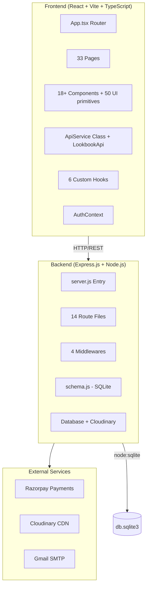

# 🔍 Flexora — Complete Deep Audit Report

---

# 1. Executive Summary

Flexora is a **fashion e-commerce + community platform** built with React (TypeScript/Vite) on the frontend and Node.js/Express with SQLite on the backend. It features user authentication, product browsing, cart/checkout with Razorpay, blogging, a community feed, design submissions, lookbooks, and a full admin panel.

**What's good:** The project has a surprisingly complete feature set for a student/side project. The architecture is clean and organized, authentication uses JWT with refresh tokens, there's rate limiting, input validation, and a proper design system with dark mode. The admin panel is comprehensive.

**What's critically wrong:**
1. **🚨 SECRETS EXPOSED**: The `.env` file is committed to the repo with real API keys (Cloudinary, Razorpay, Gmail credentials, JWT secret). This is a **P0 emergency**.
2. **Missing `blog_likes` table**: The blog engagement route references a `blog_likes` table that's not created in `schema.js`, meaning blog liking will crash.
3. **Admin content routes lack auth middleware**: Several admin content/design routes are missing `adminAuth`.
4. **`users.email` is not unique in the database**, allowing duplicate email registrations.
5. **No `FRONTEND_URL` in `.env`**, meaning password reset links default to localhost.

**Overall assessment:** Roughly **70% toward production-ready**. The foundation is solid, but there are critical security issues, several functional bugs, and meaningful UX gaps that need addressing before any real users touch this.

---

# 2. Understanding of the Product

Flexora ("Flex your Aura") is a **fashion discovery and e-commerce platform** aimed at helping users discover their personal style. Core capabilities:

| Feature Area | Description |
|---|---|
| **Style Quiz** | Personality-driven quiz to identify fashion persona (Minimalist, Bohemian, etc.) |
| **Products** | Browse, search, filter, review fashion products by category |
| **Lookbooks** | Auto-generated product collections based on style persona |
| **Cart & Checkout** | Full cart with Razorpay payment, coupon support |
| **Blog / Content** | Users can write blogs, like, comment, with rich text (TipTap) |
| **Community** | Social feed with posts, likes |
| **Design Showcase** | Users submit designs, community votes, admin moderation |
| **Admin Panel** | Full CRUD for users, products, blogs, orders, coupons, content pages |
| **Profile** | Avatar selection, profile picture upload, password change, account deletion |

---

# 3. Current Architecture



**Key Architecture Decisions:**
- Uses Node.js built-in `node:sqlite` (DatabaseSync) — no ORM
- Frontend uses native `fetch` wrapped in a custom `ApiService` class (not Axios, despite Axios being in dependencies)
- shadcn/ui component library with Tailwind CSS
- JWT auth with access/refresh token rotation
- `localStorage` for token and user data storage

---

# 4. Current Feature Inventory

### ✅ Fully Implemented
- User registration with email OTP verification
- Login/logout with JWT access + refresh tokens
- Password change, forgot/reset password flow
- Profile view/edit with avatar/profile picture
- Account deletion
- Product listing with search, filter, sort, pagination
- Product detail with reviews (create/delete)
- Shopping cart (add/update/remove/clear)
- Wishlist (add/remove/toggle)
- Razorpay checkout with coupon support
- Order history
- Blog CRUD (create with TipTap rich editor)
- Blog comments (nested 1-level, create/delete)
- Blog likes (toggle)
- Community feed (create/like/delete posts)
- Design submissions with voting
- Lookbooks (auto-generated by style persona)
- Notifications system
- Admin panel (dashboard, users, products, blogs, orders, coupons, community, content pages, design moderation)
- Dark/light theme
- Rate limiting
- Error boundary
- Skeleton loaders
- `BottomNav` for mobile
- Lazy-loaded routes

### ⚠️ Partially Implemented
- Email sending (mock mode unless Gmail configured)
- Style quiz (submits data but doesn't persist result to user profile)
- Lookbook items (add/remove works but no drag-to-reorder UI)
- `TrendSwipePopup` component exists but unclear integration
- `StudentSpotlights` and `TrendingLooks` pages exist but may use hardcoded/static data
- Admin designs moderation (pending list exists, approve/reject works)

### ❌ Missing
- Search functionality on the frontend (no global search bar)
- Product image gallery (only single image per product)
- Product variants (sizes/colors exist in cart but not on product model)
- Shipping tracking
- Invoice/receipt generation
- Email notifications for order status changes
- Social login (Google/GitHub)
- Newsletter subscription backend
- Contact us / feedback form
- Terms of Service and Privacy Policy pages (dynamic pages exist but likely empty)
- SEO meta tags (no `<Helmet>` or meta management)
- Sitemap.xml / robots.txt
- Testing (zero tests across the entire project)

---

# 5. Page-by-Page UI/UX Audit

### Page: **Home** (`/`)
- **Current purpose:** Landing page with Hero, features, trending blogs, recently viewed products, CTA for style quiz.
- **Current implementation:** Hero component, feature cards grid, trending blog cards, recently viewed products, quiz CTA.
- **Problems:**
  - `apiService.getBlogs({ trending: true, limit: 3 })` — the `getBlogs` method signature expects positional args, not an object. This is a **runtime bug** that would crash the trending section.
  - `apiService.engageBlog()` is called on line 115 but that method doesn't exist on `ApiService` (it's `likeBlog`). Another **runtime bug**.
  - `likedPosts` uses `Set<number>` but blog IDs are strings (UUIDs). Type mismatch.
  - "View All" link on trending goes to `/products` instead of a blog listing page.
  - No dedicated blogs listing page route at all.
  - Price shown as `$` but the app uses INR (₹) — currency inconsistency.
- **UI improvements:** Add a featured products carousel, a "New Arrivals" section, testimonials.
- **UX improvements:** Make the style quiz result actually navigate to the lookbook. Add social proof (user count, etc.).
- **Missing functionality:** Blog listing page, featured products section, newsletter signup.
- **Backend dependency:** None new needed.
- **Priority:** 🔴 Critical (has runtime bugs)
- **Recommended final state:** A polished landing page with hero, featured products, trending blogs, community highlights, quiz CTA, and newsletter signup.

---

### Page: **Login** (`/login`)
- **Current purpose:** User login form.
- **Problems:** No "Remember Me" option. No redirect after login to the page user came from (state `from` is passed but needs verification it's used).
- **Priority:** 🟡 Medium

### Page: **Signup** (`/signup`)
- **Current purpose:** Multi-step registration with phone and address.
- **Problems:** `escape()` on username during validation will mangle special characters. Phone validation is minimal.
- **Priority:** 🟡 Medium

### Page: **Products** (`/products`)
- **Current purpose:** Product catalog with filtering and sorting.
- **Problems:** No price range filter. No "Add to Cart" quick action from the listing. Product cards lack wishlist toggle.
- **Priority:** 🟠 High

### Page: **Product Detail** (`/products/:id`)
- **Current purpose:** Single product page with reviews.
- **Problems:** Only one product image. No size/color selection UI even though cart supports them. No "Related Products" section. No breadcrumb navigation.
- **Priority:** 🟠 High

### Page: **Cart** (`/cart`)
- **Current purpose:** Shopping cart with checkout flow.
- **Problems:** Very large file (26KB, ~700 lines). Checkout form and cart are in the same component. No loading state during payment processing.
- **Priority:** 🟠 High

### Page: **Profile** (`/profile`)
- **Current purpose:** User profile dashboard.
- **Problems:** 25KB file — too large. Mixes multiple concerns.
- **Priority:** 🟡 Medium

### Page: **Admin Panel** (`/admin`)
- **Current purpose:** Entry point that renders `AdminLayout`.
- **Problems:** All admin sub-pages are loaded together, no lazy loading within admin.
- **Priority:** 🟡 Medium

### Page: **Community Feed** (`/community`)
- **Current purpose:** Social feed with posts.
- **Problems:** No image preview before upload. No character limit indicator. Posts don't support editing.
- **Priority:** 🟢 Low

### Page: **Write Blog** (`/write-blog`)
- **Current purpose:** Blog creation with TipTap rich text editor.
- **Problems:** 28KB file. No draft save functionality. No image upload within the editor body.
- **Priority:** 🟡 Medium

### Page: **Not Found** (`*`)
- **Current purpose:** 404 page.
- **Problems:** Very minimal — just text. No illustration, no suggested links.
- **Priority:** 🟢 Low

---

# 6. Component Audit

| Component | Reusable? | Issues |
|---|---|---|
| [Navigation.tsx](file:///e:/Flexora/frontend/src/components/Navigation.tsx) | Yes | 381 lines — too large. Avatar logic (16 default avatars) should be extracted. Notification polling logic should be a hook. |
| [Hero.tsx](file:///e:/Flexora/frontend/src/components/Hero.tsx) | No | Single-use for home page. Acceptable. |
| [Footer.tsx](file:///e:/Flexora/frontend/src/components/Footer.tsx) | Yes | Good. |
| [BottomNav.tsx](file:///e:/Flexora/frontend/src/components/BottomNav.tsx) | Yes | Good mobile nav. |
| [ProtectedRoute.tsx](file:///e:/Flexora/frontend/src/components/ProtectedRoute.tsx) | Yes | Good pattern. Admin check depends on profile API call — small delay. |
| [ErrorBoundary.tsx](file:///e:/Flexora/frontend/src/components/ErrorBoundary.tsx) | Yes | Good. Could add error reporting. |
| [EmptyState.tsx](file:///e:/Flexora/frontend/src/components/EmptyState.tsx) | Yes | Good reusable component. |
| [Skeletons.tsx](file:///e:/Flexora/frontend/src/components/Skeletons.tsx) | Yes | Good, but only one skeleton variant. Needs product card, blog card, profile skeletons. |
| [FashionStyleQuiz.tsx](file:///e:/Flexora/frontend/src/components/FashionStyleQuiz.tsx) | No | 19KB — very large. Monolithic. Quiz data should be in a separate file. |
| [TipTapEditor.tsx](file:///e:/Flexora/frontend/src/components/TipTapEditor.tsx) | Yes | Good abstraction of the rich text editor. |
| [AddressManager.tsx](file:///e:/Flexora/frontend/src/components/AddressManager.tsx) | Yes | 11KB. Uses localStorage — should be backend-persistent. |
| [Suggestions.tsx](file:///e:/Flexora/frontend/src/components/Suggestions.tsx) | Unclear | 9KB. Purpose unclear from name alone — needs better naming. |
| [PageTransition.tsx](file:///e:/Flexora/frontend/src/components/PageTransition.tsx) | Yes | Very small (487B). Good. |
| `HeroSection.tsx` vs `Hero.tsx` | Duplication | Two hero components exist — likely one is unused. Needs cleanup. |
| `StyleQuiz.tsx` vs `FashionStyleQuiz.tsx` | Duplication | Two quiz components — the smaller one may be legacy. |
| [ShareButton.tsx](file:///e:/Flexora/frontend/src/components/ui/ShareButton.tsx) | Yes | Good utility component. |

**Key Issue:** Several components exceed 500 lines and should be decomposed. The `Navigation.tsx` component handles avatar logic, notification polling, menu state, and theme toggling — all of which should be separate hooks or sub-components.

---

# 7. Design System Audit

### What's Good
- Consistent color palette defined in CSS custom properties (beige/brown/cream theme)
- Dark mode with proper variable swapping
- Uses Google Fonts (Playfair Display for headings, Inter for body)
- Spacing scale defined
- Shadow scale defined
- Uses shadcn/ui primitives consistently (50 UI components)

### What Needs Improvement

| Element | Current State | Recommendation |
|---|---|---|
| **Colors** | Well-defined palette | Good — keep it |
| **Typography** | Font family set but sizes use raw values in components | Standardize with Tailwind `text-` scale |
| **Buttons** | shadcn Button with variants | Add size variants (xs, sm, md, lg) if not already |
| **Cards** | Inconsistent — some use `professional-card` class, others use shadcn `Card` | Standardize on one pattern |
| **Spacing** | CSS vars defined but rarely referenced | Use Tailwind's spacing scale consistently |
| **Icons** | Lucide React throughout | Good — consistent |
| **Toasts** | Both `sonner` and shadcn `toast` exist (`use-toast.ts` in hooks + `use-toast.ts` in ui) | Pick one. The app imports from `sonner`. Remove the unused shadcn toast. |
| **Loading states** | Skeleton exists but only one variant | Create skeleton variants for each card type |
| **Empty states** | `EmptyState` component exists | Good — use it everywhere |
| **Animations** | Custom CSS animations + Framer Motion | Good, but some animations fire on every render (should use intersection observer) |

---

# 8. User Journey Audit

### New User Journey
```
Landing → Signup → Email OTP Verification → Login → Style Quiz → Lookbook → Browse Products → Add to Cart → Checkout
```

**Friction Points:**
1. After signup, user must manually navigate to `/verify-email` — no auto-redirect
2. Style quiz result doesn't automatically navigate to the corresponding lookbook
3. No onboarding tour or welcome message after first login
4. Address must be provided at signup (unusual for fashion sites) — should be optional

### Returning User Journey
```
Login → Home → Products → Product Detail → Add to Cart → Cart → Checkout → Order Success
```

**Friction Points:**
1. No "Continue where you left off" prompt (recently viewed exists but is passive)
2. Cart is not synced between sessions if user logs in from a different device (cart is server-side, which is good)
3. Order success page (`/order-success`) doesn't show order details — just a generic message

### Blog Author Journey
```
Login → Write Blog → Fill Form → Submit → ??? (no "My Posts" page)
```

**Missing:** No way for a user to see their own published blogs. No blog editing. No draft management.

### Ideal Journey Improvements:
1. Signup → auto-redirect to verify email page with the email pre-filled
2. After quiz completion → auto-navigate to `/lookbook/<style-persona>`
3. After checkout → show order confirmation with items, address, estimated delivery
4. Add "My Posts" section to Profile page
5. Add blog editing capability

---

# 9. Frontend Technical Audit

### Architecture
- **Good:** Lazy-loaded routes, error boundary, protected routes, custom hooks pattern
- **Issue:** `QueryClient` is created without configuration — no default `staleTime`, `gcTime`, or retry settings. API calls may refetch too aggressively.

### API Communication
- **Good:** Centralized `ApiService` class with automatic token refresh
- **Issue:** Uses native `fetch` instead of Axios, even though Axios is a dependency (wasted bundle size)
- **Issue:** `ApiService.changePassword()` uses `POST` but the backend route is `PUT`
- **Issue:** `ApiService.deleteAccount()` uses `POST` but the backend route is `DELETE` and expects `password` in body
- **Issue:** Several methods use `any` type instead of proper interfaces
- **Issue:** `markNotificationRead` and `markAllNotificationsRead` use `POST` but backend expects `PUT`

### State Management
- **Good:** AuthContext for global auth state, React Query for server state
- **Issue:** Some pages (Home, Cart, Profile) manage complex local state with `useState` when they should use React Query
- **Issue:** Cart count is fetched in a hook but notifications are polled in the Navigation component directly — inconsistent pattern

### Type Safety
- **Issue:** `AuthContext` uses `any` for user type
- **Issue:** Many API methods accept and return `any`
- **Issue:** `Lookbook.tsx.backup` file exists — should be deleted

### Code Quality
- **Issue:** Several page files exceed 15KB (Cart: 26KB, Profile: 25KB, Lookbook: 31KB, WriteBlog: 28KB, EditProfile: 23KB). These should be broken into smaller components.
- **Issue:** `products.ts` in `data/` is 27KB of static data — may be legacy and unused since products are now fetched from the API
- **Issue:** Unused imports likely exist (`Users, UserCheck, UserPlus, UserX, UserMinus` imported in Navigation but never used)

### What Should Change (and WHY)
1. **Remove Axios from dependencies** — you're using `fetch`. Saves ~13KB from bundle.
2. **Fix HTTP method mismatches** — `changePassword` (POST→PUT), `deleteAccount` (POST→DELETE), notifications (POST→PUT). These will cause 404/405 errors.
3. **Add React Query config** — set `staleTime: 5 * 60 * 1000` for most queries to reduce unnecessary refetching.
4. **Split large page components** — Cart should separate CartItems, CheckoutForm, OrderSummary, CouponInput into sub-components.
5. **Delete `Lookbook.tsx.backup`** — dead code.
6. **Delete or integrate `data/products.ts`** — 27KB of static product data is likely unused now.

---

# 10. Backend Technical Audit

### Architecture
- **Good:** Clean separation (routes, middleware, models, config, utils)
- **Good:** Transaction wrapper for multi-table operations
- **Good:** WAL mode and foreign keys enabled for SQLite
- **Good:** Rate limiting with separate limits for auth vs. general vs. engagement

### Issues
1. **`blog_likes` table is missing from schema.js** — The blog engagement route on [blogs.js:185](file:///e:/Flexora/backend/routes/blogs.js#L185) tries to `INSERT INTO blog_likes` but this table is only created in [migrate.js](file:///e:/Flexora/backend/scripts/migrate.js#L25). If you haven't run migrations, blog liking crashes.
2. **Duplicate `timeAgo` function** — exists in both [utils/timeAgo.js](file:///e:/Flexora/backend/utils/timeAgo.js) and [utils/helpers.js](file:///e:/Flexora/backend/utils/helpers.js#L6). Only `timeAgo.js` is imported in blogs.
3. **Migration script creates a `lookbooks` table** with different columns than `schema.js` — potential conflicts.
4. **Migration creates indexes on non-existent columns** (`products.is_trending`, `products.category_id`) that aren't in the products schema.
5. **Community post uploads** go to a generic `/media/` path instead of a dedicated folder.
6. **`community_posts.user_id` is TEXT** but `users.id` is INTEGER — type mismatch in foreign keys.
7. **`design_submissions.user_id` is TEXT** — same issue.
8. **Generic error messages everywhere** — `"Internal server error"` gives no debugging context. At minimum, log the actual error.
9. **No `flexora.db` usage** — there's a file `flexora.db` in the backend root that seems unused (database.js points to `db.sqlite3`).

### What's Good
- Input validation with `express-validator` on critical routes
- Proper password hashing with bcrypt (salt factor 10)
- Transactions used for multi-table operations
- Pagination implemented consistently across list endpoints
- Proper HTTP status codes used

---

# 11. API Audit

### Inconsistencies Found

| Issue | Details |
|---|---|
| **Trailing slashes** | Some routes use trailing slashes (`/api/products/`), others don't (`/api/community/feed`). Inconsistent. |
| **Response format** | Products return `{ results, total, page, ... }`, cart returns a flat array, wishlist returns a flat array. Inconsistent pagination wrapping. |
| **Error key** | Some routes use `{ error: "..." }`, others use `{ detail: "..." }`. Should standardize. |
| **Auth error codes** | Login returns 401 with `detail`, registration returns 400 with `error`. |
| **HTTP methods** | `PUT /change-password/` on backend but frontend calls `POST`. Same for `DELETE /delete-account/` vs frontend `POST`. |

### Missing APIs

| Endpoint | Method | Purpose |
|---|---|---|
| `GET /api/blogs/` (with user's posts filter) | GET | Let users see their own blog posts |
| `PUT /api/blogs/:slug/` | PUT | Let users edit their own blogs |
| `DELETE /api/blogs/:slug/` | DELETE | Let users delete their own blogs |
| `GET /api/products/search/` | GET | Dedicated search with autocomplete |
| `POST /api/newsletter/subscribe/` | POST | Newsletter subscription |
| `POST /api/contact/` | POST | Contact form submission |
| `GET /api/orders/:id/invoice/` | GET | Generate PDF invoice |
| `PUT /api/community/feed/:id/` | PUT | Edit community post |

---

# 12. Database Audit

### Current Schema: 18 Tables

| Table | Issues |
|---|---|
| `users` | `email` is NOT UNIQUE — allows duplicate emails. Missing: `first_name`/`last_name` are DEFAULT '' but never set in registration. |
| `user_profiles` | Has `account_type` field — unclear purpose. Missing bio field (migration adds it to `users` instead). |
| `products` | Has both `image_url` and `image` columns — redundant. No `sizes` or `colors` JSON field. |
| `blogs` | Has both `cover_image` and `cover_image_url` — redundant. `tags` stored as comma-separated string instead of a junction table. |
| `orders` | `status` has no CHECK constraint — any string is accepted. |
| `community_posts` | `user_id` is TEXT but should be INTEGER to match `users.id`. |
| `design_submissions` | `user_id` is TEXT — same type mismatch. |
| `blog_likes` | **Table doesn't exist in schema.js** — only in migrate.js. |
| `content_pages` | Good schema. |
| `notifications` | No `expires_at` field. Old notifications accumulate indefinitely. |

### Recommended Changes
1. **Add UNIQUE constraint to `users.email`**
2. **Create `blog_likes` table in schema.js**
3. **Fix `user_id` type** in `community_posts` and `design_submissions` to INTEGER
4. **Add CHECK constraint** to `orders.status`
5. **Add indexes** on frequently queried columns: `products.category`, `blogs.slug`, `orders.user_id`, `orders.status`
6. **Add `sizes` and `colors` JSON columns** to `products` table
7. **Remove duplicate** `image` column from `products` (keep `image_url`)
8. **Add `notification_preferences` table** for user notification settings

---

# 13. Security Audit

> [!CAUTION]
> ### 🚨 CRITICAL: Secrets Exposed in `.env`

The [.env](file:///e:/Flexora/backend/.env) file contains **real credentials** and is tracked in git:
- **JWT Secret:** `flexora-jwt-secret-key-2024` — weak, predictable secret
- **Cloudinary API Key & Secret:** Fully exposed
- **Razorpay Key & Secret:** Fully exposed (test keys, but still)
- **Gmail credentials:** Real email + app password exposed
- **No `JWT_REFRESH_SECRET`** — falls back to the same `JWT_SECRET`, defeating the purpose of separate secrets

**Risk:** Anyone who clones this repo can impersonate any user, access Cloudinary, and charge Razorpay.
**Impact:** Complete account takeover, financial fraud, data breach.
**Fix:** Rotate ALL secrets immediately. Ensure `.env` is in `.gitignore` (it already is, but the file was committed before).

### Other Security Issues

| Issue | Risk | Impact | Fix |
|---|---|---|---|
| JWT secret is weak | High | Token forgery | Use `crypto.randomBytes(64).toString('hex')` |
| No CSRF protection | Medium | Cross-site request forgery | Add CSRF tokens for state-changing operations |
| Admin content routes lack `adminAuth` | High | Any user can create/edit/delete content pages | Add `adminAuth` to admin content routes (lines 933-1005 in admin.js) |
| Admin design moderation routes lack `adminAuth` | High | Any user can approve/reject designs | Add `adminAuth` to design moderation routes (lines 1008-1049 in admin.js) |
| `helmet.crossOriginResourcePolicy: false` | Low | Resources served to any origin | Acceptable for development, tighten for production |
| No file type validation beyond mimetype | Medium | MIME type can be spoofed | Add magic number/file header validation |
| Profile picture path traversal | Low | Filenames include user input | Current `multer` config generates unique names — acceptable |
| Blog content not sanitized on display | Medium | Stored XSS via TipTap HTML | Sanitize HTML before rendering on frontend |
| `escape()` on blog content in validator | Medium | Will break HTML content from TipTap | Remove `escape()` from content validation; sanitize on output instead |
| No password strength requirements beyond length | Low | Weak passwords allowed | Add complexity requirements |
| No account lockout after failed logins | Medium | Brute force via distributed attacks | Rate limiting helps but add per-account lockout |
| Admin can delete any user including themselves | Low | Self-lockout | Add check to prevent self-deletion |

---

# 14. Performance Audit

### Current Performance Positives
- Lazy-loaded routes (code splitting)
- Manual chunks in Vite config (vendor + UI separated)
- SQLite with WAL mode
- Rate limiting prevents abuse
- Pagination on all list endpoints

### Performance Issues

| Issue | Impact | Fix |
|---|---|---|
| **N+1 queries in admin orders** | Each order fetches username separately ([admin.js:886](file:///e:/Flexora/backend/routes/admin.js#L886)) | Use JOIN query |
| **N+1 queries in lookbook items** | Each item fetches product separately ([lookbooks.js:93](file:///e:/Flexora/backend/routes/lookbooks.js#L93)) | Use JOIN query |
| **No database indexes** on `products.category`, `blogs.slug`, `blogs.category` | Slow queries as data grows | Add CREATE INDEX statements |
| **Notification polling every 30s** | Unnecessary network requests | Use WebSocket or increase interval to 60s+ |
| **Unused dependencies** | Axios (13KB), `react-google-recaptcha` (not used anywhere), `lovable-tagger` | Remove unused deps to reduce bundle |
| **Product images from Unsplash** | External images load slowly, no optimization | Use Cloudinary transforms for resizing/WebP |
| **No HTTP caching headers** | Static assets not cached | Add `Cache-Control` headers for media files |
| **`data/products.ts`** is 27KB | Static data loaded even if unused | Delete if unused |
| **50 UI components imported** | All shadcn components bundled | Most are tree-shaken, but verify |
| **Blog views increment on every visit** | No deduplication per user | Track via cookie or user_id to prevent inflation |

---

# 15. Responsive/Mobile Audit

### What Works
- `BottomNav` component for mobile navigation
- `use-mobile` hook for responsive behavior
- Grid layouts use `md:` breakpoints
- Mobile menu hamburger in Navigation

### What Needs Work

| Area | Issue |
|---|---|
| **Product cards** | 2-column grid on mobile may be too cramped for detailed cards |
| **Cart page** | 26KB page with checkout form — likely very long on mobile. Needs step-by-step checkout. |
| **Admin panel** | Sidebar-based layout may not work well on mobile |
| **Tables** | Admin tables (users, orders, products) likely overflow on mobile — need horizontal scroll or card layout |
| **Blog editor** | TipTap toolbar may overflow on narrow screens |
| **Profile page** | 25KB — large page on mobile with potentially overwhelming content |
| **Images** | No `srcset` or responsive image sizes |
| **Touch targets** | Some icon buttons (like/comment) may be < 44px — below Apple's recommended minimum |
| **Typography** | Responsive typography defined for h1-h3 only |

---

# 16. Accessibility Audit

### What's Good ✅
- Skip to main content link exists
- `aria-label` on navigation
- `sr-only` text for screen readers
- Semantic `<nav>`, `<main>`, `<article>` elements used
- Focus states provided by shadcn components
- Role-based access control in ProtectedRoute

### What Needs Improvement ❌

| Issue | Fix |
|---|---|
| Many `<div>` elements used as buttons without `role="button"` | Use `<button>` elements |
| Image `alt` text is often the product name only | Add descriptive alt text |
| No `aria-live` regions for dynamic content (notifications, toast) | Add `aria-live="polite"` |
| No focus trapping in modals/drawers | shadcn Dialog may handle this — verify |
| Color contrast in muted-foreground on light mode | Warm brown on cream may fail WCAG AA |
| Form error messages not linked with `aria-describedby` | Link errors to inputs |
| No `<h1>` element on every page | Some pages may skip heading hierarchy |
| Blog content from TipTap may lack heading structure | Add heading hierarchy checks |
| Quiz options are `<div>` elements | Should be radio buttons or have proper roles |

---

# 17. Missing Features

| Feature | Problem it Solves | User Benefit | Priority |
|---|---|---|---|
| **Global search** | Users can't search across products + blogs | Faster discovery | 🟠 High |
| **Blog listing page** | No dedicated `/blogs` route | Users can't browse all blogs | 🟠 High |
| **Blog edit/delete for authors** | Authors can't manage their content | Content ownership | 🟠 High |
| **Product size/color selection** | Cart supports sizes but UI doesn't | Complete shopping experience | 🟠 High |
| **Order tracking** | Users don't know order status after payment | Post-purchase confidence | 🟡 Medium |
| **Multiple product images** | Single image limits product presentation | Better product understanding | 🟡 Medium |
| **Related products** | No cross-selling on product pages | Increased average order value | 🟡 Medium |
| **User reviews with photos** | Reviews are text-only | Richer social proof | 🟢 Low |
| **Newsletter signup** | No email marketing capability | User retention | 🟡 Medium |
| **Social login** | Only username/password | Reduced signup friction | 🟡 Medium |
| **Product comparison** | Can't compare products side-by-side | Better purchase decisions | 🟢 Future |
| **Inventory alerts** | Users don't know when stock is low | Urgency + back-in-stock notifications | 🟢 Future |

---

# 18. Recommended New UI

1. **Global Search Bar** — Overlay search with autocomplete for products and blogs
2. **Blog Listing Page** (`/blogs`) — Grid of blog cards with category filters
3. **Product Quick View** — Modal from product listing without full page load
4. **Order Detail Page** — Timeline showing order status progression
5. **"My Content" Dashboard** — Section in profile showing user's blogs, community posts, design submissions
6. **Size/Color Selector** — On product detail page with visual swatches
7. **Related Products Carousel** — On product detail page
8. **Search Results Page** — Combined results for products and blogs
9. **Better 404 Page** — With illustration and suggested links

---

# 19. Recommended Backend Changes

1. **Add `blog_likes` table to schema.js** — Critical bug fix
2. **Add `adminAuth` to content and design moderation routes** — Security fix
3. **Add UNIQUE constraint to `users.email`** — Data integrity
4. **Fix `community_posts.user_id` type** to INTEGER
5. **Add database indexes** for performance
6. **Consolidate error response format** — Always use `{ error: "message" }`
7. **Add structured logging** — Replace `console.error` with a logger like `pino`
8. **Add blog edit/delete endpoints** for blog authors
9. **Add order status email notifications** — Trigger email when admin changes order status
10. **Remove duplicate `timeAgo` utility**

---

# 20. Recommended API Changes

1. **Standardize trailing slashes** — Pick one convention, stick to it
2. **Fix HTTP method mismatches** with frontend (change-password, delete-account, notifications)
3. **Add `GET /api/blogs/mine/`** — Authenticated user's blogs
4. **Add `PUT /api/blogs/:slug/`** — Edit own blog
5. **Add `DELETE /api/blogs/:slug/`** — Delete own blog
6. **Add `GET /api/search/?q=`** — Global search endpoint
7. **Add `POST /api/newsletter/subscribe/`** — Newsletter
8. **Standardize pagination wrapper** — All list endpoints should use `{ results, total, page, limit, total_pages }`

---

# 21. Recommended Database Changes

1. `ALTER TABLE users ADD UNIQUE(email)` — Prevent duplicate emails
2. Create `blog_likes` table in schema.js
3. Add `sizes TEXT DEFAULT '[]'` and `colors TEXT DEFAULT '[]'` to `products`
4. Add `status CHECK (status IN ('pending','confirmed','shipped','delivered','cancelled'))` to `orders`
5. Add `edited_at TEXT DEFAULT NULL` to `community_posts` and `blog_comments`
6. Add index on `products(category)`, `blogs(slug)`, `blogs(category)`, `orders(user_id)`
7. Change `community_posts.user_id` from TEXT to INTEGER
8. Change `design_submissions.user_id` from TEXT to INTEGER

---

# 22. Edge Cases

| Scenario | Current Behavior | Should Behave |
|---|---|---|
| **No products** | Empty grid | EmptyState component with "No products yet" |
| **Deleted product in cart** | JOIN returns null | Remove invalid items, show notification |
| **Expired JWT during checkout** | 401 → redirect to login, losing cart state | Cart is server-side, so data preserved — good. But show "session expired" message. |
| **Very long product name** | May overflow card | `line-clamp-2` — mostly handled |
| **Duplicate email registration** | No unique constraint — silently creates duplicate | Return "Email already registered" error |
| **Payment failure** | Order marked as "failed" | Show clear failure message with retry option |
| **Slow internet** | No optimistic UI on most actions | Add optimistic updates for like, cart add |
| **First-time user** | No onboarding | Add welcome modal or guided tour |
| **Admin deletes themselves** | Succeeds — admin locked out | Prevent self-deletion |
| **0 quantity in cart** | Validation allows `quantity >= 1` | Good — handled |
| **Blog with no content** | Validation requires min 10 chars | Good — handled |
| **File upload >5MB** | Multer rejects | Show user-friendly error message on frontend |

---

# 23. Current vs Recommended Architecture

| Area | Current | Problem | Recommended | Priority |
|---|---|---|---|---|
| **Secrets** | Committed `.env` with real keys | Total compromise | Rotate keys, use env management | 🔴 |
| **Database** | SQLite (single file) | Fine for dev, not for production | Keep for now, plan PostgreSQL migration | 🟢 |
| **Auth** | JWT in localStorage | XSS can steal tokens | Move to httpOnly cookies for production | 🟡 |
| **API client** | Custom fetch wrapper + unused Axios | Wasted bundle, manual retry | Remove Axios, keep fetch wrapper | 🟡 |
| **File uploads** | Local disk + Cloudinary (admin) | Inconsistent | Standardize on Cloudinary for all uploads | 🟡 |
| **State management** | Context + React Query + localStorage | Mixed concerns | Centralize on React Query for server state | 🟡 |
| **Error handling** | Generic 500 messages | Hard to debug | Add structured logging with request IDs | 🟡 |
| **Testing** | Zero tests | No safety net | Add Jest + React Testing Library | 🟠 |
| **CI/CD** | None | Manual deployment | Add GitHub Actions pipeline | 🟢 |
| **Monitoring** | Console.log only | No visibility in production | Add error tracking (Sentry) | 🟢 |

---

# 24. Priority Matrix

## 🔴 MUST DO (Critical / Blocking)

1. **Rotate ALL secrets** — JWT, Cloudinary, Razorpay, Gmail credentials. Remove `.env` from git history.
2. **Add `blog_likes` table** to [schema.js](file:///e:/Flexora/backend/models/schema.js) — blog liking is broken without it.
3. **Add `adminAuth` middleware** to content routes and design moderation routes in [admin.js](file:///e:/Flexora/backend/routes/admin.js#L933-L1049).
4. **Fix `Home.tsx` runtime bugs** — `getBlogs()` call signature mismatch, `engageBlog()` doesn't exist.
5. **Fix HTTP method mismatches** between frontend API service and backend routes (change-password, delete-account, notifications).
6. **Add UNIQUE constraint** to `users.email`.

## 🟠 SHOULD DO (High Impact)

7. Generate a strong `JWT_SECRET` and separate `JWT_REFRESH_SECRET`.
8. Add database indexes on frequently queried columns.
9. Fix N+1 queries in lookbooks and admin orders.
10. Create a dedicated `/blogs` listing page.
11. Add size/color selection UI on product detail page.
12. Split large page components (Cart, Profile, Lookbook, WriteBlog) into sub-components.
13. Remove unused dependencies (Axios, `react-google-recaptcha`, `lovable-tagger`).
14. Delete `Lookbook.tsx.backup` and likely unused `data/products.ts`.
15. Sanitize blog HTML content on frontend display (XSS prevention).
16. Fix `community_posts.user_id` and `design_submissions.user_id` type mismatch.
17. Standardize API response format and error keys.
18. Add blog edit/delete capability for authors.

## 🟡 NICE TO HAVE (Medium Impact)

19. Add global search bar.
20. Add related products on product detail page.
21. Add order detail page with status timeline.
22. Improve 404 page design.
23. Add skeleton loader variants for different card types.
24. Move notification polling to a custom hook.
25. Add React Query default configuration (staleTime, retry).
26. Improve accessibility (aria labels, heading hierarchy, color contrast).
27. Add responsive image handling (srcset, Cloudinary transforms).
28. Consolidate duplicate `timeAgo` utility.
29. Consolidate or remove duplicate quiz/hero components.
30. Add `<Helmet>` for SEO meta tags per page.

## 🟢 FUTURE (Polish & Scale)

31. Add testing (unit + integration).
32. Set up CI/CD pipeline.
33. Migrate to PostgreSQL for production.
34. Add WebSocket for real-time notifications.
35. Add social login (Google OAuth).
36. Add newsletter subscription.
37. Add invoice generation.
38. Add product image gallery (multiple images).
39. Add order tracking with shipping integration.
40. Add error monitoring (Sentry).

---

# 25. Complete Implementation Roadmap

### Phase 1 — 🔴 Fix Critical Issues (1-2 days)
1. Rotate all secrets, regenerate strong JWT secrets
2. Remove `.env` from git history (`git filter-branch` or `BFG`)
3. Add `blog_likes` table to schema.js
4. Add `adminAuth` to unprotected admin routes
5. Add `UNIQUE(email)` to users table
6. Fix Home.tsx runtime bugs
7. Fix HTTP method mismatches in API service

### Phase 2 — 🟠 Core Functionality Fixes (3-5 days)
1. Add database indexes
2. Fix N+1 queries
3. Fix foreign key type mismatches
4. Standardize API response format
5. Add blog listing page (`/blogs`)
6. Add blog edit/delete for authors
7. Add size/color selection on product detail
8. Remove unused dependencies and dead code
9. Sanitize blog HTML on frontend

### Phase 3 — 🟠 Frontend Architecture (3-5 days)
1. Split Cart, Profile, Lookbook, WriteBlog into sub-components
2. Extract Navigation notification logic into a hook
3. Configure React Query defaults
4. Remove duplicate components (Hero/HeroSection, StyleQuiz/FashionStyleQuiz)
5. Add proper TypeScript types (replace `any`)
6. Add skeleton variants

### Phase 4 — 🟡 UI/UX Polish (5-7 days)
1. Add global search
2. Add related products section
3. Improve 404 page
4. Add onboarding flow for new users
5. Improve order success page with order details
6. Add "My Content" section to profile
7. Add SEO meta tags with React Helmet
8. Improve accessibility

### Phase 5 — 🟡 Backend Hardening (3-5 days)
1. Add structured logging
2. Add order status email notifications
3. Add newsletter subscription endpoint
4. Add contact form endpoint
5. Consolidate file upload strategy (all via Cloudinary)
6. Add proper password strength validation

### Phase 6 — 🟢 Production Readiness (Ongoing)
1. Add unit and integration tests
2. Set up GitHub Actions CI/CD
3. Add error monitoring
4. Performance optimization (image optimization, caching headers)
5. PostgreSQL migration planning
6. Security audit with penetration testing

---

# 26. Master Checklist

## Security
- [ ] Rotate JWT_SECRET (use 256-bit random key)
- [ ] Add separate JWT_REFRESH_SECRET
- [ ] Rotate Cloudinary API credentials
- [ ] Rotate Razorpay credentials
- [ ] Rotate Gmail app password
- [ ] Remove `.env` from git history
- [ ] Add `adminAuth` to admin content routes (L933-L1005 in admin.js)
- [ ] Add `adminAuth` to admin design routes (L1008-L1049 in admin.js)
- [ ] Sanitize blog HTML content before rendering
- [ ] Remove `escape()` from blog content validation (breaks HTML)
- [ ] Add CSRF protection for state-changing endpoints
- [ ] Add account lockout after repeated failed logins
- [ ] Prevent admin self-deletion

## Database
- [ ] Add `blog_likes` table to schema.js
- [ ] Add UNIQUE constraint to `users.email`
- [ ] Fix `community_posts.user_id` type (TEXT → INTEGER)
- [ ] Fix `design_submissions.user_id` type (TEXT → INTEGER)
- [ ] Add CHECK constraint on `orders.status`
- [ ] Add indexes on `products.category`, `blogs.slug`, `orders.user_id`
- [ ] Remove redundant `products.image` column (keep `image_url`)
- [ ] Remove redundant `blogs.cover_image` column (keep `cover_image_url`)
- [ ] Clean up unused `flexora.db` file

## Backend
- [ ] Fix duplicate `timeAgo` utility (consolidate into one)
- [ ] Fix N+1 queries in lookbook items (use JOIN)
- [ ] Fix N+1 queries in admin orders (use JOIN)
- [ ] Add blog edit endpoint (`PUT /api/blogs/:slug/`)
- [ ] Add blog delete endpoint for authors (`DELETE /api/blogs/:slug/`)
- [ ] Add user's blogs endpoint (`GET /api/blogs/mine/`)
- [ ] Add global search endpoint
- [ ] Add newsletter subscription endpoint
- [ ] Standardize error response format (`{ error: "..." }`)
- [ ] Add structured logging (replace console.log/error)
- [ ] Add order status change email notifications

## API
- [ ] Standardize trailing slash convention
- [ ] Fix `changePassword` method (POST → PUT)
- [ ] Fix `deleteAccount` method (POST → DELETE, include password)
- [ ] Fix `markNotificationRead` method (POST → PUT)
- [ ] Fix `markAllNotificationsRead` method (POST → PUT)
- [ ] Standardize pagination response format across all endpoints
- [ ] Add proper TypeScript interfaces for all API responses

## Frontend
- [ ] Fix Home.tsx `getBlogs()` call signature
- [ ] Fix Home.tsx `engageBlog()` → `likeBlog()`
- [ ] Fix Home.tsx `likedPosts` type (Set\<number\> → Set\<string\>)
- [ ] Fix currency display ($ → ₹)
- [ ] Remove unused Axios dependency
- [ ] Remove unused `react-google-recaptcha` dependency
- [ ] Delete `Lookbook.tsx.backup`
- [ ] Evaluate and remove `data/products.ts` if unused
- [ ] Remove unused icon imports from Navigation.tsx
- [ ] Configure React Query defaults (staleTime, gcTime)
- [ ] Split Cart.tsx into sub-components
- [ ] Split Profile.tsx into sub-components
- [ ] Split Lookbook.tsx into sub-components
- [ ] Split WriteBlog.tsx into sub-components
- [ ] Extract notification polling from Navigation into a hook
- [ ] Extract avatar logic from Navigation into a utility

## UI/UX
- [ ] Create dedicated `/blogs` listing page
- [ ] Add global search bar to navigation
- [ ] Add size/color selection on product detail page
- [ ] Add related products section on product detail
- [ ] Improve order success page (show order details)
- [ ] Improve 404 page with illustration
- [ ] Add "My Content" section to profile page
- [ ] Add onboarding flow for new users
- [ ] Auto-redirect to verify-email after signup
- [ ] Navigate to lookbook after quiz completion
- [ ] Add breadcrumb navigation on product detail
- [ ] Add skeleton variants for blog cards and profile sections

## Accessibility
- [ ] Replace `<div>` click handlers with `<button>` elements
- [ ] Add descriptive alt text to product images
- [ ] Add `aria-live` regions for notifications and toasts
- [ ] Ensure color contrast meets WCAG AA (warm-brown on cream)
- [ ] Link form errors with `aria-describedby`
- [ ] Add `<h1>` to every page
- [ ] Add `role` attributes to quiz options
- [ ] Test keyboard navigation through all forms

## Responsive/Mobile
- [ ] Add responsive image sizes (srcset or Cloudinary transforms)
- [ ] Ensure touch targets are ≥44px on mobile
- [ ] Add responsive table layouts for admin panel
- [ ] Test checkout flow on mobile (step-by-step)
- [ ] Test blog editor on mobile screens

## Performance
- [ ] Remove unused dependencies from bundle
- [ ] Add database indexes
- [ ] Fix N+1 queries
- [ ] Reduce notification polling frequency or use WebSocket
- [ ] Add Cache-Control headers for static assets
- [ ] Deduplicate blog view counting (per user/session)
- [ ] Optimize product images via Cloudinary transforms

## Testing
- [ ] Set up Jest for backend unit tests
- [ ] Set up React Testing Library for frontend
- [ ] Add tests for auth flow (register, login, refresh)
- [ ] Add tests for payment flow
- [ ] Add tests for admin authorization
- [ ] Add E2E tests for critical user journeys

## Deployment & DevOps
- [ ] Set up GitHub Actions for CI (lint, test, build)
- [ ] Add production environment configuration
- [ ] Set up error monitoring (Sentry or similar)
- [ ] Add health check endpoint
- [ ] Create production Docker setup
- [ ] Add robots.txt and sitemap.xml

## Documentation
- [ ] Update README with actual current features
- [ ] Document all API endpoints (OpenAPI/Swagger)
- [ ] Document environment variable requirements
- [ ] Add contributing guidelines
- [ ] Document deployment process

---

# 27. Final "What I Should Do First" List

If you can only work on 5 things right now, do these:

1. **🔴 Rotate ALL secrets** and remove `.env` from git history. This is a zero-day emergency if the repo is public.

2. **🔴 Add the `blog_likes` table** to `schema.js` and re-run migrations. Blog liking is currently broken.

3. **🔴 Fix the Home.tsx runtime bugs** — the `getBlogs()` call and `engageBlog()` reference will crash the home page.

4. **🔴 Add `adminAuth` middleware** to the 6 unprotected admin routes (content CRUD + design moderation). Any logged-in user can currently create/edit/delete site content.

5. **🔴 Fix HTTP method mismatches** between the frontend `ApiService` and backend routes — change-password, delete-account, and notification-read will silently fail or error.

These five changes go from "broken and insecure" to "functional and safe." Everything else can follow the phased roadmap.
